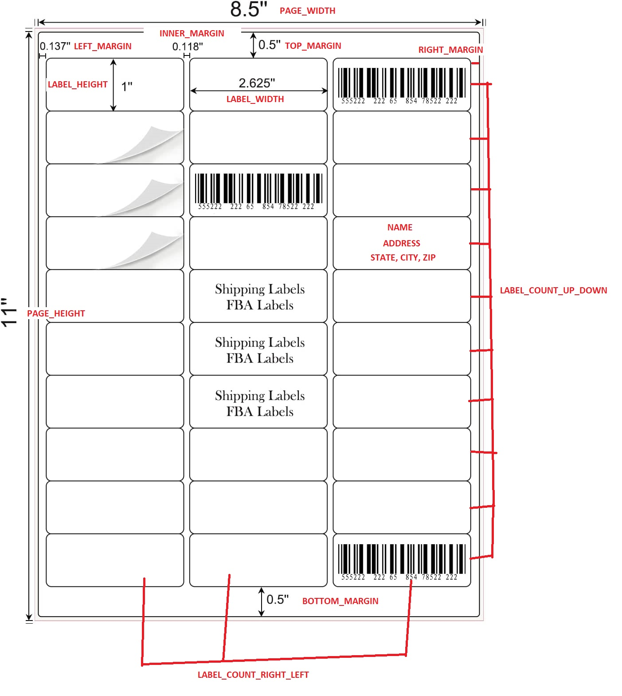
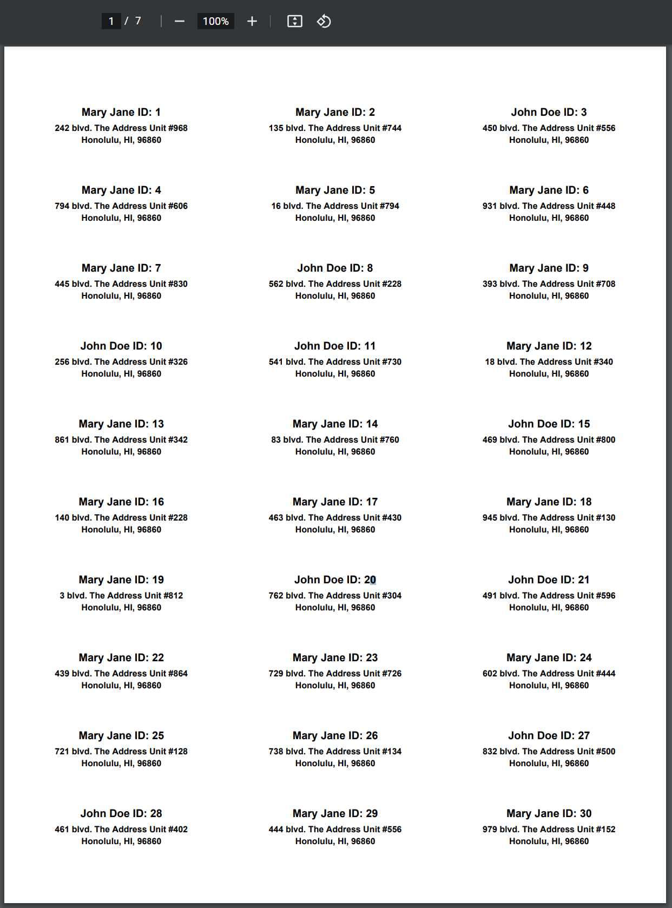

# Description

This simple python program, <b>main.py</b>, creates labels in a .pdf file ready to print from any home printer for any amount of labels. Only thing required is to write a function to import the contacts from an external file and call the correct function to add each contact when the program starts. This program has **ALREADY BEEN PRE-CONFIGURED for the following Amazon labels (1" x 2-5/8" | 30 sheets)**

[logo]: readme/amazon_logo.jpg "Configured for these labels available at Amazon"

![Amazon Logos][logo]

Link to these labels located at Amazon: https://www.amazon.com/Address-Labels-Sticker-Printer-mailing/dp/B09P16YV2K/

<p align="center">
    <h3>Label Specifications</h3>
    The red text corresponds to the configuration variables inside the code.
</p>

<p align="center">
  
</p>

<p align="center">
    <h3>This program currently produces this output</h3>
</p>

<p align="center">
  
</p>

# Installation

Program tested and working for Python 3.10.3

Run Commands:

- pip install fpdf2
- python main.py

# Instructions

Include a .CSV file in the same directory as main.py with the following format and <b>N</b> number of contacts and labels will be generated for them:

`NAME, ADDRESS, CITY, STATE, ZIP, COUNTRY`

`Example Name 1, Example City 1, Example State 1, Example Zip 1, Example Country 1`

`Example Name 2, Example City 2, Example State 2, Example Zip 2, Example Country 2`

`...`

`Example Name N, Example City N, Example State N, Example Zip N, Example Country N`

> **Folder Structure:**

    .
    ├── ...
    ├── main.py   # Python File
    ├── any_csv_with_correct_headers.csv  # Contacts in CSV format with correct format
    ├──labels.pdf  # Will generate this file
    └── ...

<h2>OR</h2>

Write the code to import contacts from an external list of contacts and call this function located in the program to add people to the master list. The labels should automatically be generated before the program finishes.

```
def add_person_for_label(person_id, name, address, city, state, zip, country):
    '''
    Adds a person to the master people list for label creation

    #param person_id: ID for a person used only for testing
    #param name: Name of the person
    #param address: The address for the person
    #param city: The city for the person
    #param state: The state for the person
    #param zip: The zip for the person
    #param country: The country for the person
    '''
    people.append({
        "PERSON_ID": person_id,
        "NAME": name,
        "ADDRESS": address,
        "CITY": city,
        "STATE": state,
        "ZIP": zip,
        "COUNTRY": country
    })
```
It will currently produce the labels to be printed inside the same directory where main.py is run.

This program may possibly need to be slightly tuned to create expected output, although the dimensions for the Amazon product described have been correctly pre-configured. The right margin appears to be whatever space is left after everything was added so it is my guess that the right margin having more space than the left margin matches how the labels appear on the printing paper. If not then the labels may need to be slightly shifted to the right by modifying the LEFT_MARGIN variable.

# This program utilizes FPDF2

Please read the FPDF2 documentation for additional configuration assistance: https://pyfpdf.github.io/fpdf2/
