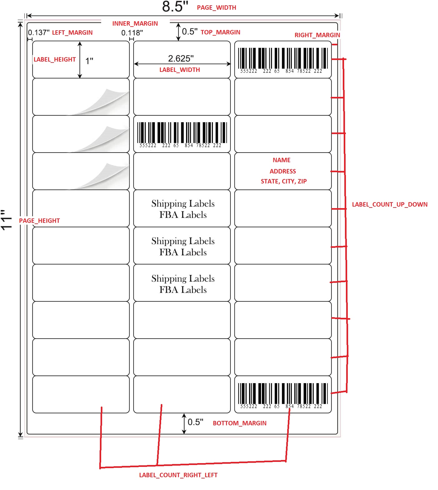
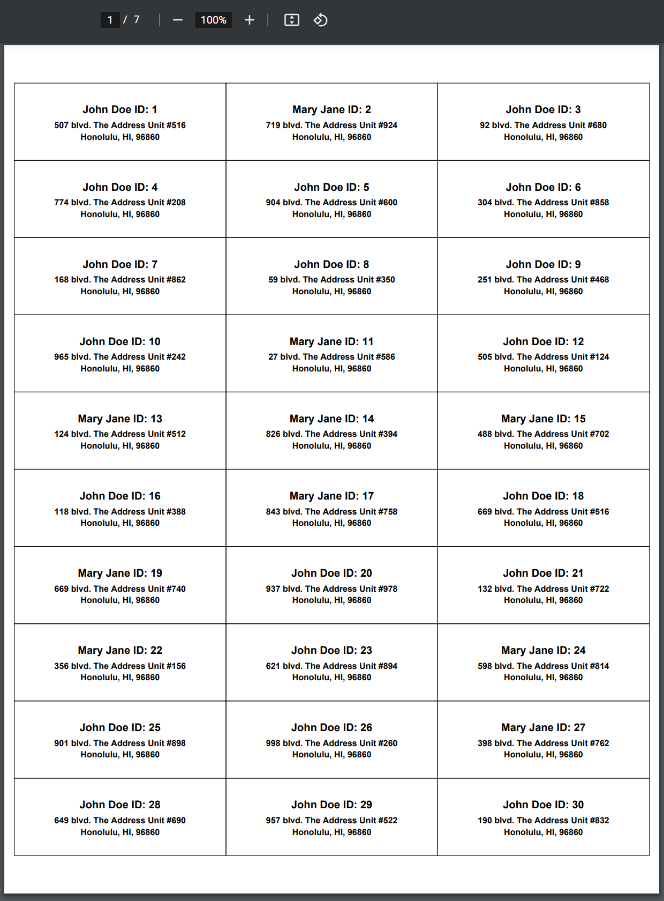

# Description

This simple python program creates labels in a .pdf file ready to print from any home printer for any amount of people. Only thing required is to write a function to import the contacts from an external file and call the correct function to add each contact when the program starts. This program has **ALREADY BEEN PRE-CONFIGURED for the following Amazon labels.**

[logo]: amazon_logo.jpg "Configured for these labels available at Amazon"

![Amazon Logos][logo]

Link to these labels located at Amazon: https://www.amazon.com/Address-Labels-Sticker-Printer-mailing/dp/B09P16YV2K/

<p align="center">
    <h3>Label Specifications</h3>
    The red text corresponds to the configuration variables inside the code.
</p>

<p align="center">
  
</p>

<p align="center">
    <h3>This program currently produces this output</h3>
</p>

<p align="center">
  
</p>

# Installation

Program tested and working for Python 3.10.3

1. pip install fpdf2

# Instructions

Write the code to import contacts from an external list of contacts and call this function located in the program to add people to the master list. The labels should automatically be generated before the program finishes.

```
def add_person_for_label(person_id, name, address, city, state, zip):
    '''
    Adds a person to the master people list for label creation

    #param person_id: ID for a person used only for testing
    #param name: Name of the person
    #param address: The address for the person
    #param city: The city for the person
    #param state: The state for the person
    #param zip: The zip for the person
    '''
    people.append({
        "PERSON_ID": person_id,
        "NAME": name,
        "ADDRESS": address,
        "CITY": city,
        "STATE": state,
        "ZIP": zip
    })
```
It will currently produce the labels to be printed inside the same directory where main.py is run.

# This program utilizes FPDF2

Please read the FPDF2 documentation for additional configuration assistance: https://pyfpdf.github.io/fpdf2/
